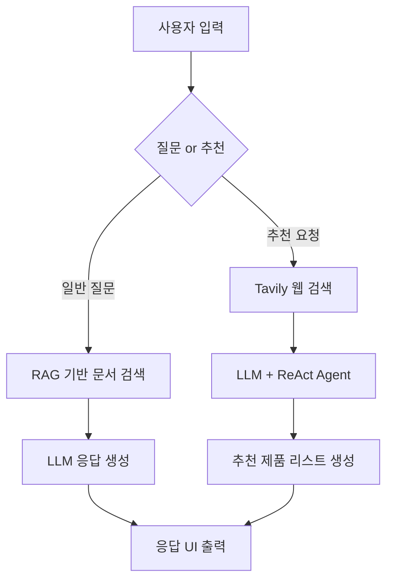

# 🌿 NutriWise - AI 기반 개인 맞춤형 영양제 추천 시스템

  

**NutriWise**는 식품의약품안전처 건강기능식품정보 및 웹 기반 실시간 검색을 활용하여, 사용자의 연령, 성별, 건강 관심사에 따라 맞춤형 영양제를 추천하는 **RAG + LLM 기반 AI 챗봇 및 추천 시스템**입니다.

---

## 📖 목차

* 👨‍💻 팀 소개
* 🛠️ 기술 스택
* 💡 프로젝트 개요 및 필요성
* 🗂 데이터 및 모델 구성
* ⚙️ 시스템 아키텍처
* 🧠 챗봇 질의 흐름
* 💬 주요 기능 (Streamlit UI)
* 📊 추천 시스템 구성
* 📝 테스트 계획 및 보고서
* 📈 성능 개선 및 향후 과제
* 🗣️ 프로젝트 회고

---

## 👨‍💻 팀 소개

### 팀명: NutriWise

|                   **문상희**                  |                   **김재아**                  |                   **박빛나**                  |                   **서은선**                  |                   **안윤지**                  |                   **조성재**                  |
| :----------------------------------------: | :----------------------------------------: | :----------------------------------------: | :----------------------------------------: | :----------------------------------------: | :----------------------------------------: |
|  |  |  |  |  |  |

---

## 🛠️ 기술 스택

| 카테고리           | 기술                                                                                         |
| -------------- | ------------------------------------------------------------------------------------------ |
| **Language**   |                                    |
| **Framework**  |                  |
| **LLM**        |     |
| **Embedding**  |                   |
| **Web Search** |                                |
| **Vector DB**  |  |
| **Tools**      | GitHub, Notion, VS Code                                                                    |

---

## 💡 프로젝트 개요 및 필요성

* 건강기능식품 시장은 급성장 중이며, 소비자의 연령, 성별, 건강 목적에 따라 다양한 니즈가 존재함
* 하지만 사용자 맞춤형 정보 제공이 미흡하고, 비전문적 추천이 난무

**NutriWise**는 이러한 문제를 해결하기 위해,

* 정부 공공 데이터를 활용한 **신뢰성 있는 정보 제공**
* **LLM + RAG 기반의 질의응답 시스템**
* **웹 검색 기반 실시간 맞춤 추천 기능** 을 제공하는 헬스케어 AI 시스템입니다.

---

## 🗂 데이터 및 모델 구성

### ✅ 활용 데이터

* 식품의약품안전처 건강기능식품 기능성 정보
* NIH, iHerb 등 웹 기반 실시간 제품 정보

### ✅ 임베딩 모델 & DB

* **Embedding**: OpenAI Embeddings
* **Vector Store**: Pinecone (LangChain 연동)

### ✅ RAG 기반 챗봇

* LangChain 기반 RAG 구조 (문서 임베딩 → 유사도 검색 → GPT 응답 생성)
* 주제 확장 및 문서 기반 출처 제시

### ✅ 실시간 추천 시스템

* TavilySearch + LangChain Agent 기반 ReAct Agent 사용
* 사용자 입력 → 웹 검색 → 제품 정보 정제 → JSON 형태 반환

---

## ⚙️ 시스템 아키텍처

---

## 🧠 챗봇 질의 흐름

1. 사용자 질문 입력
2. 질문 확장 및 문서 유사도 검색 (LangChain + Pinecone)
3. 관련 문서 기반 GPT 응답 생성
4. 근거 문서 및 설명과 함께 응답 출력

---

## 💬 주요 기능 (Streamlit UI)

### 📌 질의응답 (RAG 기반)

* 샘플 질문 버튼 제공
* 사용자 입력 기반 RAG 흐름 실행
* 과거 Q\&A 히스토리 카드 형태 출력

### 📌 맞춤 추천 (Tavily 기반)

* 사용자 정보 입력 (나이, 성별, 임신 여부, 관심 건강 주제)
* 관심사에 따라 쿼리 생성 → ReAct 기반 검색 실행
* 결과를 카드 형태로 출력 (제품명, 가격, 성분, 효과 등 시각화)

---

## 📊 추천 시스템 구성

* LangChain ReAct Agent 사용
* Prompt 내 명확한 JSON 포맷 요구
* GPT 응답 → Python에서 JSON 파싱 후 1\~3개 제품 렌더링
* 제품 이미지, 성분, 기대 효과, 복용법, 주의사항 등 시각화 구성

---

## 📝 테스트 계획 및 보고서

* 다양한 프롬프트 전략, 벡터 DB 구성 방법 비교 테스트
* 테스트 예시, 결과 비교표, 오류 케이스 정리 (산출물 포함)
* 주요 이슈:

  * 응답 형식 불일치
  * 프롬프트 가이드 미준수
  * 검색 정확도 향상을 위한 문서 청크 기준 조정 필요

---

## 📈 성능 개선 및 향후 과제

### ✅ 개선 사항

* 프롬프트: JSON 응답 강제, 예시 삽입, 환각 최소화
* 검색 정확도 향상: Tavily 검색 키워드 최적화
* RAG 응답 품질 향상: chunk size 및 overlap 조정 실험

### 🔜 향후 과제

* 제품 리뷰 기반 감성 분석 추가
* 사용자의 건강 상태 입력 → 진단형 추천 시스템 고도화
* 실시간 리뷰/상품 정보 업데이트 자동화
* 다양한 언어 및 국가 지원 (글로벌 버전 확장)

---

## 🗣️ 프로젝트 한줄 회고

| 이름      | 한 줄 회고                               |
| ------- | ------------------------------------ |
| **문상희** | 사용자에게 진짜 도움 되는 서비스를 고민하는 계기가 됨       |
| **김재아** | 기술뿐 아니라 UX까지 고려한 설계의 중요성을 체감함        |
| **박빛나** | LLM의 가능성과 한계를 동시에 배운 뜻깊은 경험          |
| **서은선** | 실시간 추천 구현 과정에서 LangChain의 구조를 깊이 이해함 |
| **안윤지** | 사용자 입력 처리부터 응답 생성까지 전 과정을 연결해볼 수 있었음 |
| **조성재** | 협업을 통해 AI 프로젝트가 어떤 식으로 완성되는지 체감함     |
