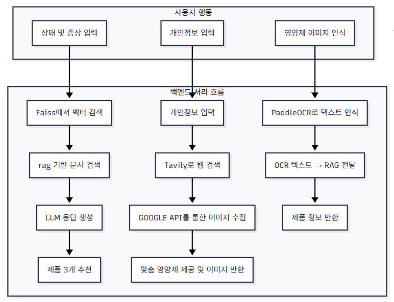
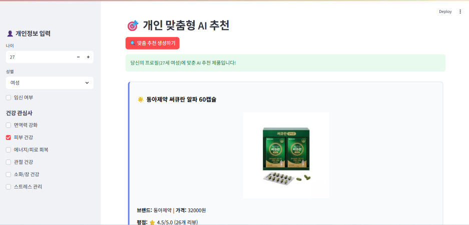

# 🌿 NutriWise - AI 기반 개인 맞춤형 영양제 추천 시스템

<p align="center">
  
</p>

**뉴트리아**는 식품의약품안전처 건강기능식품정보 및 웹 기반 실시간 검색을 활용하여, 사용자의 연령, 성별, 건강 관심사에 따라 맞춤형 영양제를 추천하는 **RAG + LLM 기반 AI 챗봇 및 추천 시스템**입니다.

---

## 📖 목차

* 👨‍💻 팀 소개
* 🛠️ 기술 스택
* 💡 프로젝트 개요 및 필요성
* ⚙️ 설치 및 환경 설정
* 🗂 데이터 및 모델 구성
* ⚙️ 시스템 아키텍처
* 🧠 챗봇 질의 흐름
* 💬 주요 기능 (Streamlit UI)
* 📊 추천 시스템 구성
* 📈 향후 개선 방향
* 🗣️ 프로젝트 회고

---

## 👨‍💻 팀 소개

### 팀명: 뉴트리아

|                   **문상희**                   |                         **김재아**                         |                   **박빛나**                    |                           **서은선**                            |                   **안윤지**                  |                     **조성재**                     |
|:-------------------------------------------:|:-------------------------------------------------------:|:--------------------------------------------:|:------------------------------------------------------------:| :----------------------------------------: |:-----------------------------------------------:|
|  |  |  |  |  |  |

---

## 🛠️ 기술 스택

| 카테고리           | 기술                                                                                                                                                                                                                                                       |
| -------------- |----------------------------------------------------------------------------------------------------------------------------------------------------------------------------------------------------------------------------------------------------------|
| **Language**   |  |
| **Framework**  |  |
| **LLM** |  |
| **Embedding**  |  |
| **Web Search** |  |
| **Vector DB** |  |
| **Tools**      |    |

---

## 💡 프로젝트 개요 및 필요성
### 🧾 프로젝트 개요
현대인은 피로, 스트레스, 면역 저하, 수면 장애 등 다양한 건강 이슈에 직면하고 있으며, 건강기능식품에 대한 관심은 꾸준히 증가하고 있습니다.  
그러나 사용자들은 제품의 효능, 성분, 복용법 등에 대한 정보가 흩어져 있어 **신뢰할 수 있는 정보를 찾기 어렵고**,  
자신의 연령, 성별, 건강 상태에 맞는 제품을 **스스로 선택하기가 쉽지 않은 상황**입니다.

**본 프로젝트 NutriWise**는 이러한 문제를 해결하기 위해 개발된  
**RAG(Retrieval-Augmented Generation) 기반 영양제 추천 시스템**입니다.

- 사용자의 **건강 목표, 연령, 성별, 임신 여부 등** 프로필 정보를 기반으로  
  **유사 문서를 검색**하고, LLM을 통해 **신뢰도 높은 맞춤형 답변**을 생성합니다.

- **웹 검색** 기능을 통해 최신 제품이나 보충 정보를 반영할 수 있습니다.

- **OCR 기반 이미지 인식 기능**으로 영양제 사진만으로도 제품을 분석할 수 있습니다.


  
  

---

### ❗ 프로젝트 필요성
- **영양제 복용의 일상화**  
  전체 응답자의 약 94%가 영양제를 복용하고 있으며, 하루에 2~3개 이상을 복용하는 경우도 많습니다. 그러나 자신의 상태에 맞는 제품을 정확히 선택하기는 어렵습니다.

- **신뢰하기 어려운 정보에 대한 의존**  
  많은 분들이 포털 검색, 인플루언서 게시글, 지인 추천 등을 통해 정보를 얻고 있지만, 이는 정확성과 신뢰도가 떨어질 수 있습니다. 의료진이나 공식 자료를 통한 정보 획득 비율은 상대적으로 낮은 편입니다.

**NutriWise**는 이러한 문제를 해결하기 위해,

* 정부 공공 데이터를 활용한 **신뢰성 있는 정보 제공**
* **LLM + RAG 기반의 질의응답 시스템**
* **웹 검색 기반 실시간 맞춤 추천 기능** 을 제공하는 헬스케어 AI 시스템입니다.

---
## ⚙️ 환경 설정
NutriWise를 실행하기 위해 아래 항목들을 반드시 설정해야 합니다.

### 1️⃣ 패키지 설치
다음 명령어로 프로젝트에 필요한 모든 Python 패키지 설치합니다.

```bash
pip install -r requirements.txt
```

### 2️⃣ 환경 변수 (.env) 설정
.env 파일을 프로젝트 루트에 생성하고, 아래 항목들을 입력합니다.
```
PINECONE_API_KEY=your_pinecone_key
OPENAI_API_KEY=your_openai_key
DECODING_KEY=your_decoding_key
GOOGLE_API_KEY=your_google_api_key
GOOGLE_CSE_ID=your_google_cse_id
```

### 3️⃣ FAISS 인덱스 파일 다운로드
아래 링크를 통해 `index.faiss`와 `index.pkl` 파일을 다운로드하고, `04_code_release/faiss_index`에 포함시켜 주세요:

👉 [index.faiss](https://drive.google.com/file/d/12hBmF6i9Fj9Ils0EQV0gC7a8QR5EMcHa/view?usp=sharing)

👉 [index.pkl](https://drive.google.com/file/d/1p6yoErMdihSAURiuySzpTsb9bYk4iGMn/view?usp=sharing)


### 4️⃣ 프로젝트 디렉토리 구조
```
SKN14_3rd_1Team/
│
├── 01_data_preprocessing/
│   ├── data_document_vectordb_faiss.py
│   └── data_document_vectordb_pinecone.py
│
├── 02_system_architecture/
│   └── architecture.png
│
├── 03_test_report/
│   └── 1Team_NutriWise_test_report.pdf
│
├── 04_code_release/
│   ├── faiss_index/
│   │   ├── index.faiss
│   │   └── index.pkl
│   ├── app.py
│   ├── config.py
│   ├── ocr_llm.py
│   ├── rag_chatbot.py
│   └── recommend.py
│
├── images/
│
├── .env
├── .gitignore
├── LICENSE
├── README.md
└── requirements.txt
```
---

## 💡 실행

```bash
cd 04_code_release
streamlit run app.py
```

## 🗂 데이터 및 모델 구성

### ✅ 활용 데이터

- **[식품의약품안전처 건강기능식품 기능성 정보](https://www.data.go.kr/data/15056760/openapi.do#tab_layer_detail_function)**  

## 🛠️ 데이터 전처리 방식

본 프로젝트에서는 RAG 기반 문서 검색 및 LLM 응답 생성을 위해, 식품의약품안전처 건강기능식품 기능성 정보 데이터를 다음과 같은 절차로 전처리하였습니다.

### 1. 원천 데이터 수집
- OpenAPI를 통해 JSON 형식으로 수집
- 주요 항목: 제품명, 제조사, 기능성, 섭취 시 주의사항, 보관조건, 유통기한

### 2. 문서화 및 정제
- JSON 데이터를 LangChain의 `Document` 형식으로 변환
- 각 항목을 정리하여 텍스트 문단 형식으로 구성하고, 일부 정보는 `metadata`에 저장

### 3. 임베딩을 위한 전처리
- 텍스트 길이에 따라 일정 단위로 나누어 분절 (chunking)
- 특수문자 제거, 불필요한 HTML 태그 제거 등 기본 클렌징 적용

### 4. 벡터 임베딩 및 저장
- OpenAI Embedding API (`text-embedding-ada-002`)를 이용하여 문서 임베딩
- Faiss 벡터 데이터베이스에 인덱스 생성 및 저장
  - Index 이름: 프로젝트 환경 설정 파일(config)에서 관리
  - 검색 파라미터: `k=3` 유사 문서 검색

### 5. RAG 검색용 리트리버 구성
- Faiss에 저장된 벡터를 기반으로 LangChain Retriever 구성
- 사용자의 질의에 대해 유사도가 높은 문서 3개를 검색하여 LLM의 응답 컨텍스트로 활용


### ✅ 임베딩 모델 & DB

* **Embedding**: OpenAI Embeddings
* **Vector Store**: Faiss

### ✅ RAG 기반 챗봇

* LangChain 기반 RAG 구조 (문서 임베딩 → 유사도 검색 → GPT 응답 생성)
* 주제 확장 및 문서 기반 출처 제시

### ✅ 실시간 추천 시스템

* TavilySearch + Google 이미지 검색
* 사용자 입력 → 웹 검색 → 이미지 검색
* 제품 정보와 사진을 함께 제공 

---

## ⚙️ 시스템 아키텍처
 

---

## 🧠 챗봇 질의 흐름

| 단계 | 설명                                                                                   |
|------|--------------------------------------------------------------------------------------|
| 📝 **1. 질문 입력** | 사용자가 Streamlit UI에서 질문 입력<br>예: *“피로 회복에 좋은 영양제는?”*                                  |
| 🔍 **2. 문서 검색** | 사용자 질문 + 프로필(나이/성별/관심사 등)을 결합해 의미 확장<br>LangChain Retriever가 Faiss에서 유사 문서 **3건** 검색 |
| 🤖 **3. GPT 응답 생성** | 검색된 문서를 `context`로 활용하여 GPT가 응답 생성<br>정확한 형식과 문서 기반 지식만 사용                           |
| 📢 **4. 응답 출력** | 응답을 화면에 출력<br>필요 시 근거 문서 정보 및 주의사항도 함께 제공<br>※ 항상 마지막에 “전문가 상담 권장” 문구 포함             |


---

## 💬 주요 기능 (Streamlit UI)
### 📌 메인화면


### 📌 질의응답 (RAG + LLM 기반)

* 샘플 질문 버튼 제공
* 사용자 입력 기반 RAG 흐름 실행

### 📌 맞춤 추천 (Tavily 기반)


* 사용자 정보 입력 (나이, 성별, 임신 여부, 관심 건강 주제)
* 관심사에 따라 쿼리 생성 → ReAct 기반 검색 실행
* 결과를 카드 형태로 출력 (제품명, 가격, 성분, 효과 등 시각화)

### 📌 사진 검색 및 분석 (OCR +  RAG 기반)


* 이미지 업로드 → 텍스트(OCR) 추출 → RAG 기반 정보 검색  
* 제품명 등 키워드로 효능·성분·주의사항 자동 안내  
* 텍스트 인식과 문서 검색을 결합한 직관적인 추천 방식

---

## 📊 추천 시스템 구성

* LangChain ReAct Agent 사용
* Prompt 내 명확한 JSON 포맷 요구
* GPT 응답 → Python에서 JSON 파싱 후 1\~3개 제품 렌더링
* 제품 이미지, 성분, 기대 효과, 복용법, 주의사항 등 시각화 구성

---

## 📈 향후 개선 방향

### ✅ 개선 사항
* 📈 **사용자 피드백 반영**  
  추천 결과에 대한 사용자 평가(👍 / 👎)를 수집하여 추후 추천 정확도 개선에 활용
* 🌐 **다국어 지원 기능 확장**  
  영어 및 기타 언어 사용자 대응을 위한 멀티랭귀지 출력 기능 개발 예정
* ⚡ **모델 및 검색 응답 속도 향상**  
  현재 GPT-4.1-mini 모델 기반 RAG 응답은 문서 검색 및 LLM 생성 속도에서 다소 지연이 발생  
  추후 경량 모델(GPT-3.5-turbo 등) 조건부 사용, RAG 캐싱, 문서 압축 등을 통해 응답 속도를 개선할 에정


### 🔜 향후 과제

* 제품 리뷰 기반 감성 분석 추가
* 사용자의 건강 상태 입력 → 진단형 추천 시스템 고도화
* 실시간 리뷰/상품 정보 업데이트 자동화
* 다양한 언어 및 국가 지원 (글로벌 버전 확장)

---

## 🗣️ 프로젝트 한줄 회고

| 이름      | 한 줄 회고                               |
| ------- | ------------------------------------ |
| **문상희** | RAG 검색과 OCR 연동을 구현하며 벡터 생성부터 검색까지의 흐름을 직접 경험할 수 있었습니다.       |
| **김재아** | RAG와 LLM을 복습하는 시간이라고 생각하는 좋은 기회였습니다~!        |
| **박빛나** | RAG와 LLM로 사용자 입력 처리부터 응답 생성까지 전 과정을 연결해보면서 큰 흐름을 이해하게 되어 좋았습니다!          |
| **서은선** | 느렸지만 확실하게, 챗봇의 구조를 이해할 수 있었습니다. |
| **안윤지** | 벡터 DB 저장부터 RAG를 연결해보고, tavily까지 활용할 수 있어서 의미있었습니다! |
| **조성재** |  RAG와 LLM에 대해 더 많이 알수있는 프로젝트여서 좋았습니다!     |
